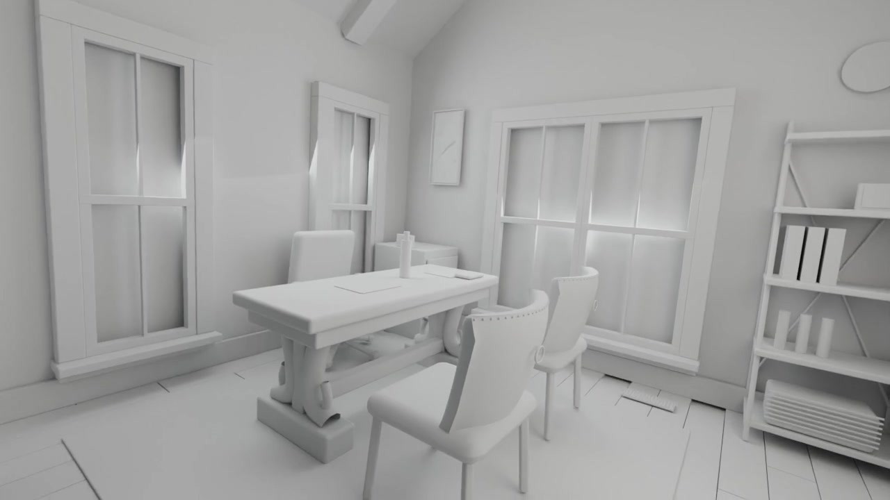

# AHa-3D: Agentic Tool Use for Real2Sim with GPT-6 Astra

[简体中文](README_zh-CN.md)

**[Project page](https://kevinxu02.github.io/real2sim-indoor-site/)**

AHa-3D turns an ordinary indoor video into an editable 3D scene in Blender. It
rebuilds the room from reference geometry and a library of reusable furniture and
materials, estimates the motion of the people in the video, places them in the
shared room with foot-ground and object contact refinement, and renders the result
with the original camera and timing. It can also generate new actions for people
in the scene and export saved scenes as interactive browser demos.

## Demo

[](https://kevinxu02.github.io/real2sim-indoor-site/)

An office rebuilt from a 10-second video and rendered through the recovered source
camera ([MP4](https://raw.githubusercontent.com/KevinXu02/aha-3d/main/docs/media/office48_whitebox.mp4)).
Open the editable scene in [examples/office48](examples/office48/README.md) with Blender 5.2. The [project page](https://kevinxu02.github.io/real2sim-indoor-site/)
shows it next to the source video and hosts an interactive scene.

## Quick start

**Requirements:** one Linux workstation (Ubuntu or WSL2) with an NVIDIA GPU,
Python 3.11 and compatible Blender for scene assembly. Human skinning also
needs Blender 4.5 and its body extension. See the [runtime policy](MACHINE.md)
and [three installation levels](docs/INSTALLATION.md) for details.

1. **Clone and choose an installation level.** The installer asks whether to
   prepare Static, Human reconstruction or Robotics motion generation before
   it changes an environment.

   ```bash
   git clone https://github.com/KevinXu02/aha-3d.git && cd aha-3d
   bash tools/setup.sh
   ```

   For a noninteractive run, answer with `--level static`, `--level human` or
   `--level robotics`; no level is chosen by default. `--plan` shows the
   selected route without installing.

2. **Finish the selected level's model and Blender setup.** Static needs
   [Pi3X/SAM3 checkpoints and Blender](docs/PI3X_GEOMETRY_REFERENCE.md#runtime).
   Level 2 also needs [PMPose, GVHMR and body skinning](docs/install/human-motion.md),
   installed in their separate environments. Level 3 adds
   [Kimodo, native G1 and text models](docs/install/kimodo.md) to Static.
   The selector prepares Level 2's Static and SAM3 decoding code, then names
   its remaining installation steps.

3. **Check the selected route and start a scene.** For native G1 motion:

   ```bash
   python kimodo_blender/check_runtime.py --model g1
   python -m unittest discover -s tests -v
   ```

   To reconstruct your own video, put it under `references/`, describe the
   scene with `bash tools/indoor intake`, and follow the
   [scene workflow](docs/SCENE_WORKFLOW.md). The [examples](examples/README.md)
   cover generated motion after its model and runtime are configured.

Browse the assets with `python tools/asset_index.py tree`. [Setup](docs/SETUP.md)
covers a source-only install and troubleshooting.

## Tools

### Scene pipeline: `tools/indoor`

A single command drives scene work from request to delivery. Runs are resumable,
and each one gets its own directory under `runs/`.

| Command | What it does |
| --- | --- |
| `intake` | Turn a scene request into a plan and list any missing decisions |
| `scenes`, `plan` | List scenes; summarize a recipe's stages and runtime without running anything |
| `preflight` | Check the recipe, inputs and optional segmentation bounds before a run |
| `run`, `batch` | Run one recipe in the foreground, or queue several in a background worker |
| `status` | Show run and worker progress |
| `preview`, `review-layout`, `accept-preview` | Render a full-length preview and record reviews |
| `check-placement` | Check saved-room geometry and object stability |
| `acceptance`, `results` | Track completion criteria and register the selected deliveries |

Run `bash tools/indoor --help` for all options, and see [pipeline](docs/PIPELINE.md).

### Capabilities

| Area | What you get | Guide |
| --- | --- | --- |
| Room reconstruction | Reference geometry and cameras from the source video, turned into an editable Blender room | [Real2sim pipeline](docs/REAL2SIM_PIPELINE.md) |
| People from video | Multi-person tracking, pose and body estimation, alignment into the shared room | [Human pipeline](docs/HUMAN_PIPELINE_GUIDE.md) |
| Motion refinement | World-space optimization plus foot-ground and object contact refinement, with slip and collision checks | [Contact refinement](docs/CONTACT_REFINEMENT.md) |
| Generated motion | New or changed actions for people in the scene, including object interaction | [Motion controls](docs/MOTION_CONTROLS.md) |
| Asset library | Furniture, plants, articulated cabinets and procedural materials with search and orientation metadata | [Asset catalog](assets/INDEX.md) |
| Scene variants | Swap furniture and materials in a saved scene while keeping IDs and orientation | [Scene variants](docs/SCENE_VARIANTS.md) |
| Rendering and review | Previews, full renders, video decoding checks and review images | [Rendering](docs/RENDERING.md) |
| Browser demos | Interactive web viewer with grabbable furniture, cabinet controls and baked animation | [Browser demo](.agents/skills/blender-browser-demo/SKILL.md) |

### Helper scripts

| Script | Purpose |
| --- | --- |
| `tools/asset_index.py` | Search and rebuild the asset index |
| `tools/build_catalog.py` | Build the browsable catalog in [docs/catalog](docs/catalog/README.md) |
| `tools/scene_variant.py` | Apply furniture and material replacements to a scene |
| `tools/export_articulated_asset.py` | Export operable furniture such as cabinets and drawers |
| `tools/configure_runtime.py` | Write the local runtime profile |
| `tools/task_claim.py` | Coordinate several agents or people working in one checkout |

The project also ships agent skills in `.agents/skills/` for AI coding agents;
see [tools and skills](TOOLS_AND_SKILLS.md). Opus 5.5 can also drive this repository
based on initial experiments, but it has not been fully tested.

## Project layout

```text
aha-3d/
├── src/aha3d/        Core library: pipeline stages, Blender assembly, motion, workflow checks
├── tools/            Command-line tools and stage scripts
├── assets/           Reusable furniture, plant and material libraries
├── configs/          Runtime templates, cabinet layouts and request presets
├── examples/         Example scene configurations
├── docs/             Guides, workflow contracts and installation notes
├── tests/            Unit tests and optional Blender integration checks
├── .agents/skills/   Agent skills for AI coding agents
├── references/       Your source videos (contents not tracked)
├── scenes/           Your scene workspaces (contents not tracked)
└── runs/             Pipeline outputs (contents not tracked)
```

Start from the [documentation index](docs/INDEX.md) for the full set of guides.

## License

Project-authored code, skills and assets are licensed under the
[Apache License 2.0](LICENSE). See [distribution notes](DISTRIBUTION.md) for scope
and [third-party dependencies](THIRD_PARTY.md) for models and libraries obtained
separately.
