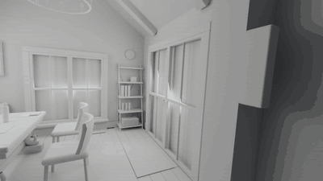

# AHa-3D: Agentic Tool Use for Real2Sim with GPT-6 Astra

**[Project page](https://kevinxu02.github.io/real2sim-indoor-site/)**

AHa-3D turns an ordinary indoor video into an editable 3D scene in Blender. It
rebuilds the room from reference geometry and a library of reusable furniture and
materials, estimates the motion of the people in the video, places them in the
shared room with foot-ground and object contact refinement, and renders the result
with the original camera and timing. It can also generate new actions for people
in the scene and export saved scenes as interactive browser demos.

Human motion comes from monocular estimation, so it is approximate rather than
ground-truth capture. Reference videos, model weights and generated runs are not
included, apart from one demo scene; bring your own footage and obtain model files
from their upstream projects.

## Demo

[](https://kevinxu02.github.io/real2sim-indoor-site/)

An office room rebuilt from a 10-second video, rendered through the camera recovered
from that video. The editable scene is in [examples/office48](examples/office48/README.md);
open it in Blender 5.2 with no other setup. The [project page](https://kevinxu02.github.io/real2sim-indoor-site/)
compares it with the source video and a reconstruction made without the harness,
and hosts an interactive scene demo.

## Quick start

**Requirements:** one Linux workstation (Ubuntu or WSL2) with an NVIDIA GPU
(24 GB class recommended), Python 3.11, Blender 5.2 for scene assembly and
Blender 4.5 for skinning. See the [runtime policy](MACHINE.md) for details.

1. **Clone and install the core environment.**

   ```bash
   git clone https://github.com/KevinXu02/aha-3d.git && cd aha-3d
   export KIMODO_ENV="${KIMODO_ENV:-$PWD/.venv}"
   bash tools/setup_core.sh --plan   # show what will be installed
   bash tools/setup_core.sh
   ```

2. **Point the project at your Blender builds and model checkpoints.**

   ```bash
   source kimodo_blender/env.sh      # run in every new shell
   python tools/configure_runtime.py --blender /path/to/blender-5.2/blender \
     --skin-blender /path/to/blender-4.5/blender \
     --kimodo "$KIMODO_UPSTREAM" --checkpoint "$KIMODO_CHECKPOINT"
   ```

   The [installation guide](docs/INSTALLATION.md) lists every model and where to
   get it. Download only what you need.

3. **Check the setup.**

   ```bash
   python kimodo_blender/check_runtime.py
   python -m unittest discover -s tests -v
   ```

4. **Run a first scene.** The bundled example is a smoke test: it generates a
   five-second walk from a text prompt without a room or a source video.

   ```bash
   cp -r examples/new_scene scenes/new_scene
   bash tools/indoor plan new_scene --recipe walk
   bash tools/indoor run new_scene --recipe walk --motion-only
   ```

   To look at a finished reconstruction instead, open the
   [office demo](examples/office48/README.md) in Blender. For a real
   reconstruction, put your video under `references/`, describe the
   request with `bash tools/indoor intake`, and follow the
   [scene workflow](docs/SCENE_WORKFLOW.md).

If you only want to browse the assets, Python's standard library is enough:
`python tools/asset_index.py tree`. [Setup](docs/SETUP.md) covers a lightweight
source-only install and troubleshooting.

## Tools

### Scene pipeline: `tools/indoor`

A single command drives scene work from request to delivery. Runs are resumable,
and each one gets its own directory under `runs/`.

| Command | What it does |
| --- | --- |
| `intake` | Turn a scene request into a plan and list any missing decisions |
| `scenes`, `plan` | List scenes; summarize a recipe's stages and runtime without running anything |
| `preflight` | Check the recipe, inputs and optional segmentation bounds before a run |
| `run`, `batch` | Run one recipe in the foreground, or queue several in a background worker |
| `status` | Show run and worker progress |
| `preview`, `review-layout`, `accept-preview` | Render a cheap full-length preview and record reviews |
| `check-placement` | Check saved-room geometry and object stability |
| `acceptance`, `results` | Track completion criteria and register the selected deliveries |

Run `bash tools/indoor --help` for all options, and see [pipeline](docs/PIPELINE.md).

### Capabilities

| Area | What you get | Guide |
| --- | --- | --- |
| Room reconstruction | Reference geometry and cameras from the source video, turned into an editable Blender room | [Real2sim pipeline](docs/REAL2SIM_PIPELINE.md) |
| People from video | Multi-person tracking, pose and body estimation, alignment into the shared room | [Human pipeline](docs/HUMAN_PIPELINE_GUIDE.md) |
| Motion refinement | World-space optimization plus foot-ground and object contact refinement, with slip and collision checks | [Contact refinement](docs/CONTACT_REFINEMENT.md) |
| Generated motion | New or changed actions for people in the scene, including object interaction | [Motion controls](docs/MOTION_CONTROLS.md) |
| Asset library | Furniture, plants, articulated cabinets and procedural materials with search and orientation metadata | [Asset catalog](assets/INDEX.md) |
| Scene variants | Swap furniture and materials in a saved scene while keeping IDs and orientation | [Scene variants](docs/SCENE_VARIANTS.md) |
| Rendering and review | Previews, full renders, video decoding checks and review images | [Rendering](docs/RENDERING.md) |
| Browser demos | Interactive web viewer with grabbable furniture, cabinet controls and baked animation | [Browser demo](.agents/skills/blender-browser-demo/SKILL.md) |

### Helper scripts

| Script | Purpose |
| --- | --- |
| `tools/asset_index.py` | Search and rebuild the asset index |
| `tools/build_catalog.py` | Build the browsable catalog in [docs/catalog](docs/catalog/README.md) |
| `tools/scene_variant.py` | Apply furniture and material replacements to a scene |
| `tools/export_articulated_asset.py` | Export operable furniture such as cabinets and drawers |
| `tools/configure_runtime.py` | Write the local runtime profile |
| `tools/task_claim.py` | Coordinate several agents or people working in one checkout |

The project also ships agent skills in `.agents/skills/` for AI coding agents;
see [tools and skills](TOOLS_AND_SKILLS.md).

## Project layout

```text
aha-3d/
├── src/aha3d/        Core library: pipeline stages, Blender assembly, motion, workflow checks
├── tools/            Command-line tools and stage scripts
├── assets/           Reusable furniture, plant and material libraries
├── configs/          Runtime templates, cabinet layouts and request presets
├── examples/         Example scene configurations
├── docs/             Guides, workflow contracts and installation notes
├── tests/            Unit tests and optional Blender integration checks
├── .agents/skills/   Agent skills for AI coding agents
├── references/       Your source videos (contents not tracked)
├── scenes/           Your scene workspaces (contents not tracked)
└── runs/             Pipeline outputs (contents not tracked)
```

Start from the [documentation index](docs/INDEX.md) for the full set of guides.

## License

Project-authored code, skills and assets are licensed under the
[Apache License 2.0](LICENSE). See [distribution notes](DISTRIBUTION.md) for scope
and [third-party dependencies](THIRD_PARTY.md) for models and libraries obtained
separately.
