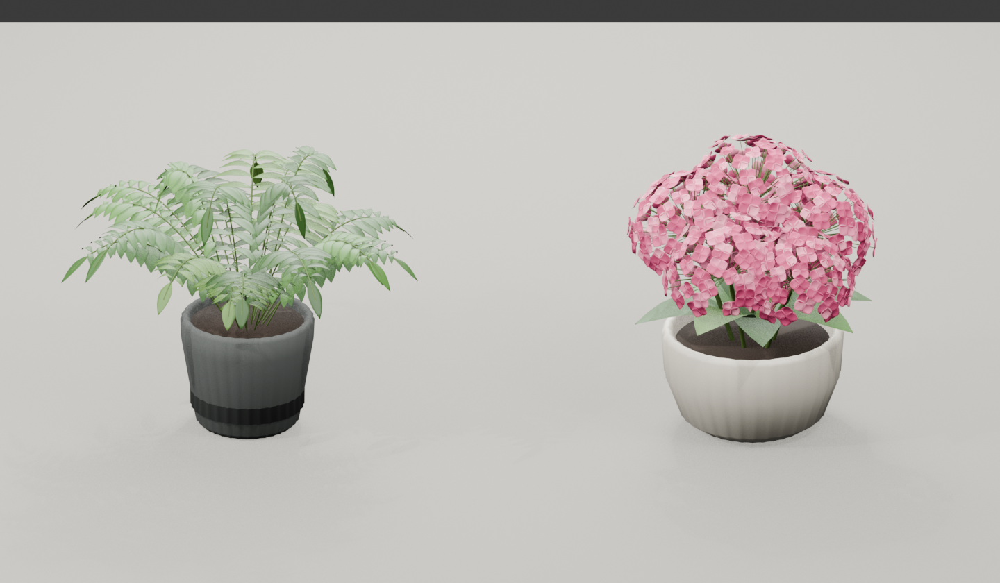

# Tabletop plants v1

Two editable authored ornamental models, with embedded procedural materials and
physical pot-bottom centers at their mounting origins. No external model or
photographic texture is required. Seed20260912 is the reviewed realization.

| Registered item | Native W x D x H (m) | Geometry |
| --- | --- | --- |
| `tabletop-plants-v1/plant-compact-fern` | 0.353 x0.355 x0.276 | 21 arched fronds, attached thin leaflets, soil and charcoal ribbed pot |
| `tabletop-plants-v1/flowers-pink-hydrangea-bowl` | 0.248 x0.232 x0.294 | Five heads,390 four-petal florets, connecting pedicels/stems, basal leaves and ivory bowl |



Other reviewed views: [top](top.png), [side](side.png), [low support view](low.png).
The complete model libraries contain44/33 editable mesh parts and51,648/145,458
vertices respectively. Materials are embedded dependencies, not separately
advertised material designs. Exported modifiers are baked. Presentation front
is-Y, upZ; asymmetrical foliage bounds do not define the mounting center.

```python
from aha3d.blender.roomkit import place_asset
plant = place_asset('tabletop-plants-v1/plant-compact-fern',
                    location=(0, 0, .9), scale=.82,
                    instance_id='countertop fern', project_root=project_root)
```

Use the pot bottom as the support point. Registered import was exercised with
two independent fern instances at different scales and one flower arrangement;
saving/reopening retained bounds and zero pot-bottom Z. See [validation](validation.json)
and [provenance](provenance.json). The library has no linked data or file-texture
dependencies. Native parts/materials remain editable after import.

The breakfast-nook replacement used scale.82 for the fern and.92 for flowers,
at the unchanged prior prop positions. Both evaluated pot/table gaps were below
1e-7 predicted metres. Six source-camera contour views and room previews were
reviewed; the original899-frame camera remained unchanged. That room uses
independent lower-gloss, darker foliage material copies to suit its bright lights.

These are stylized botanical approximations. Local leaflet/floret intersections
are possible and are not an exhaustive foliage-clearance guarantee. The ceramic
flower bowl is an intentional model replacement for the earlier glass placeholder.

Builder: [build_tabletop_plant_assets.py](../../../tools/build_tabletop_plant_assets.py)
uses the shared RoomKit export workflow. Create a new output/library version for
changes; do not overwrite this binary. Building a candidate does not automatically
register it. Review/export/import/reopen and explicit registry promotion remain
part of asset closeout.
